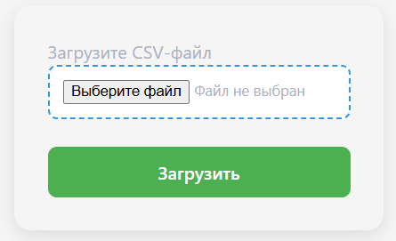
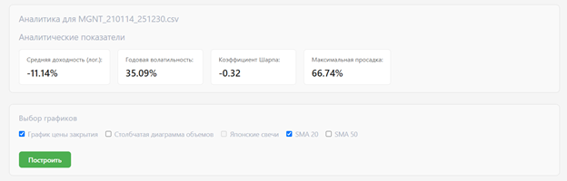
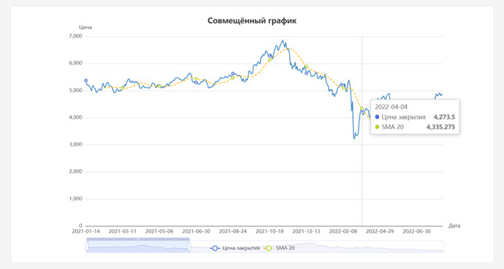
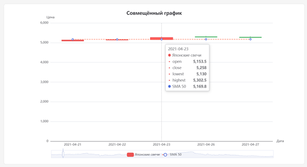
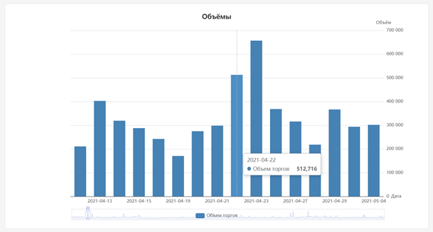
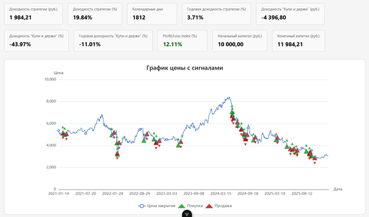
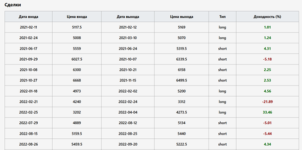
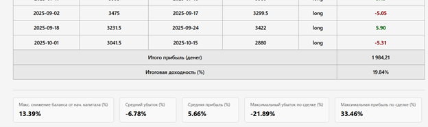

# Приложение для применения торговых стратегий и финансового анализа

Веб-приложение для анализа финансовых данных и оценки инвестиционных стратегий.

Приложение позволяет загружать данные котировок, выполнять статистический анализ, визуализировать изменения показателей и оценивать результаты применения торговых стратегий.

## О проекте

Основные задачи:

- загрузка и обработка данных о ценных бумагах;
- расчет финансовых показателей;
- визуализация динамики роста с применением аналитических инструментов;
- анализ результатов инвестиционных стратегий.

## Технологический стек

### Backend

- Python
- Django
- Django REST Framework

### Frontend

- Vue 3
- JavaScript
- HTML
- CSS
- Axios

### Database

- SQLite 

# Скриншоты

## Интерфейс приложения

### Загрузка файла .csv с данными

## Анализ

### Анализ финансовых показателей

## Визуализация данных

Визуализация изменения финансовых показателей:

## Применение торговой стратегии

